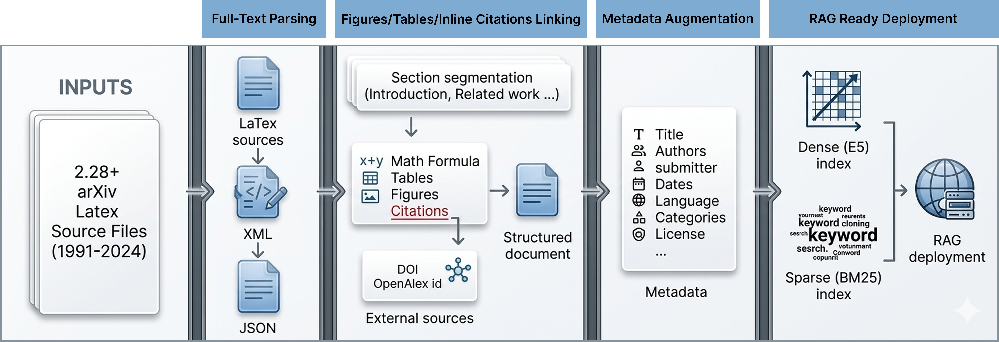

# UnarXive-2024

This project presents an updated and extended version of the UnarXive dataset, a large-scale full-text scholarly corpus derived from [arXiv.org](https://arxiv.org). We process and structure over **2.28 million papers**, preserving rich document content and enriching metadata. Our pipeline enhances section-level grouping while maintaining compatibility with existing formats.

Link to: [Paper](http://www.lrec-conf.org/proceedings/lrec2026/pdf/2026.lrec2026-1.556.pdf)

You can access the dataset from [HuggingFace](https://huggingface.co/datasets/ines-besrour/unarxive_2024) and on [Zenodo](https://doi.org/10.5281/zenodo.17431594)

## Dataset Overview
The dataset consists of structured JSONL files, each representing a parsed scholarly document from arXiv. Each document includes:

- Full-text grouped by sections
- Metadata (title, authors, abstract, date, language, cited_by_count etc.)
- Citation information (bib entries and reference entries)
- Structural annotations like `cite_spans` and `ref_spans`
- Licensing and category labels

---

## Pipeline


## Key Statistics
The total number of papers in our dataset is **2,338,911**.
Among these:
- **Physics**: 1,146,066 papers (49.12%)
- **Mathematics**: 584,727 papers (25.28%)
- **Computer Science**: 608,118 papers (25,6%)
**Languages**: Predominantly English, with several hundred documents in other languages

---

## Usage
The dataset can be used for:
- Retrieval-augmented generation (RAG)
- Citation recommendation and analysis
- Scientific question answering
- Training and evaluation of domain-specific language models (e.g., SciBERT, SciNCL)

---

## Citation
If you use this repository, please cite:

```bibtex
@inproceedings{besrour-etal-2026-unarxive,
  author    = {Besrour, Ines and F\"{a}rber, Michael},
  title     = {unarXive 2024: A Large-Scale Scientific Corpus for Citation-Aware Retrieval and Generation},
  year      = {2026},
  publisher = {European Language Resources Association (ELRA)},
  address   = {Palma, Mallorca, Spain},
  doi       = {10.63317/2nqzwzhq3j3t},
  booktitle = {Proceedings of the Fifteenth Language Resources and Evaluation Conference (LREC 2026)},
  pages     = {6990--6997},
  series    = {LREC 2026},
  issn      = {2522-2686},
  isbn      = {978-2-493814-49-4}
}
